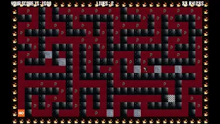

# Shadow Runners

Shadow Runners is a 2D maze runner game developed as a first semester group project.

# Gameplay preview (Click on image)

 # Tech Stack
- C++
- SFML

# Gameplay
- Navigate through maze levels
- Avoid obstacles
- Collect objects for a higher score
- Keyboard-based controls

# Project Context
Built with two classmates as an introductory game development project for the Programming Fundamentals course.

To run game:

Copy all files out of subfolders into a main folder and place the new folder in the compiler/IDE directory
